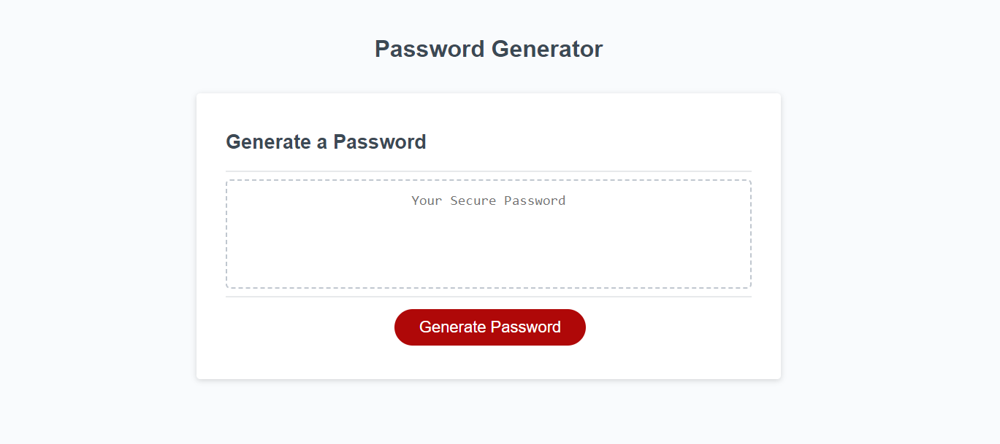
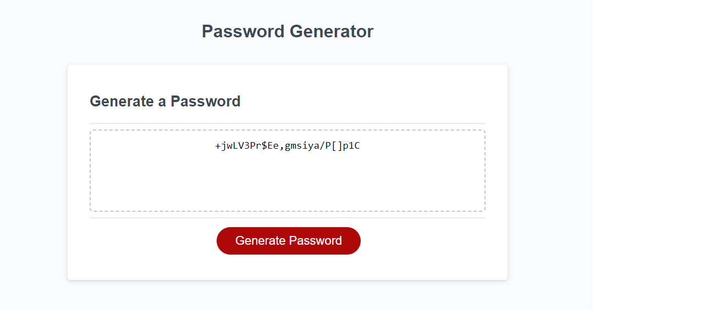

# password-generator-w-JS
Powered by JavaScript app to randomly generate password for user

The generator is designed to create secure and customisable passwords by allowing users to choose from different sets of characters. 

## To use this password generator, follow these steps:

Open the index.html file in a web browser.
-Click the "Generate Password" button.
-Enter the desired password length (between 10 and 64 characters).
-The generator will prompt you for preferences:
Choose whether to include uppercase letters.
Choose whether to include lowercase letters.
Choose whether to include numbers.
Choose whether to include special characters.
After entering your preferences, the generator will provide you with a random password based on your selections.

## Find preview before & after below

### Before

### After

You can access the deployed version online: [View script in Website](https://b70b70.github.io/password-generator-w-JS/)

This random password generator effort was carried out by Faheem Ali.